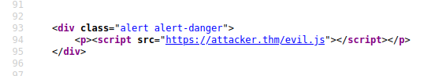

If a website lets you enter code as a query parameter, then you can take advantage of it. 

e.g. 

When renders this

Could be hijacked to this. 

## Methods

1. Parameters in the URL 
2. URL File Path
3. HTTP Headers (rare)