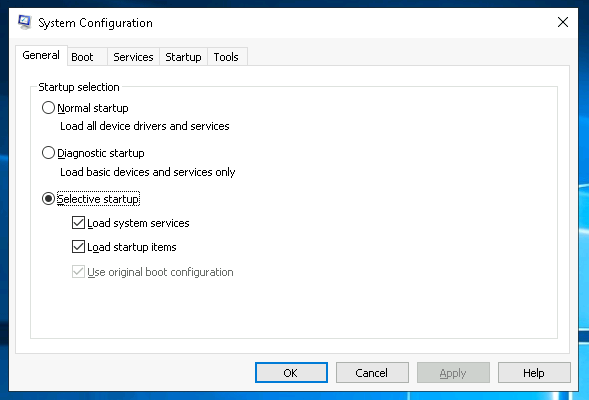
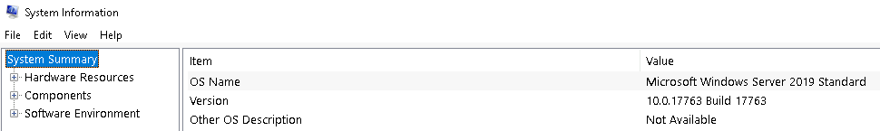

# Windows Tools

https://tryhackme.com/module/windows-fundamentals  
https://tryhackme.com/room/windowsfundamentals2x0x  
https://tryhackme.com/room/windowsfundamentals3xzx  

System Configuration
`msconfig.exe`

`msinfo32.exe`

Computer Management
`compmgmt`

Performance Monitor
`perfmon`

Local Users and Groups
`lusrmgr.msc`

Resource Monitor
`resmon.exe`

Registry Editor
`regedt32.exe`

## All Commands

https://ss64.com/nt/

